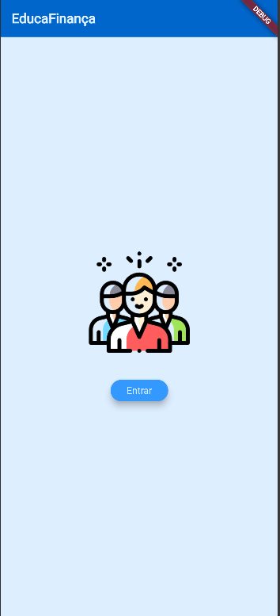
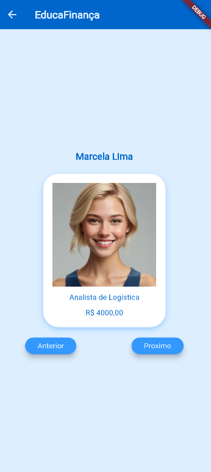

# Funcionários
Aprendendo flutter, mockup JSON, estilização com "theme", imagens

## Tecnologias
- Flutter
- Android Studio
- VsCode

## Passos para testar
- Clonar o repositorio
- Abrir com VsCode e em um terminal digitar
```bash
flutter pub get
flutter run
```

## Prints

|||
|:-:|:-:|
|Splash|Home com Funcionários|